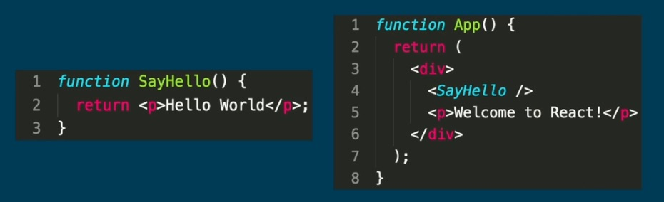

<strong>Declarative</strong>: Describe what the UI should look like, not all of the implementation details.
<strong>Component-based</strong>: Reusable piece of UIs, like custom HTML tags
Unidirectional data flow: Data flows in 1 direction (parent -> child)

In modern React, components are usually functional components, which are simply functions that return JSX.

JSX (JavaScript XML) a type of syntax extension for inlining XML and HTML in JavaScript.
For example, this code could be compiled into standard JavaScript function calls to create a heading element.

```js
const h1 = <h1>Hello World</h1>;
```

Package for inserting React element in the DOM:

```js
ReactDOM.render(element, DOMContainer);
```

A function component is a function that returns a ReactElement (JSX)


---

When a component needs to re-render React might decide to remove and re-add that DOM node, which would result in removing our event listeners. So, as a general rule, we avoid using any traditional DOM manipulation on DOM nodes created by React. We use attributes or props instead.

---

<strong>Synthetic Event</strong>: The object type passed to React event handler functions. Synthetic Events generally work the same as native events, but with more consistency across browsers.

```js
//Example of synthetic event (1), and native event (2)
function handleClick(event) {
  console.log(event, event.nativeEvent);
}
```

---

<strong>State</strong>: Data specific to an instance of a component that persists between renders and causes re-renders when changed.

<strong>Hook</strong>: A JS function used to "hook" into React features such as state and the larger component lifecycle. The names of hooks always begin with <strong>use</strong>, and they cannot be called conditionally.

<strong>useState</strong>: A React hook for creating stateful components. The <strong>useState</strong> function takes in an initial state value (or a function that returns that initial value), and it returns an array with two elements: the current state value and a setter function. For example:

```js
const [number, setNumber] = useState(42);
```

<strong>useReducer</strong>: An alternative React hook for creating stateful components, oftentimes used for more complex state. The <strong>useReducer</strong> function takes in a reducer function and the initial state. It returns an array with two elements: the current state value and a dispatch function.

The reducer function takes in the previous state and an action object as parameters, then it returns the new state. Usually the action object will have a <strong>type</strong> property, which will be used in a switch statement. For example:

```js
function reducer(state, action) {
  switch (action.type) {
    case "increment":
      return { count: state.count + action.num };
    case "decrement":
      return { count: state.count - action.num };
    default:
      throw new Error("Unkown action type");
  }
}
```

The dispatch function will then take in an object, which will be passed as the action tot he reducer function. For example:

```js
const [state, dispatch] = useReducer(reducer, { count: 0 });

return (
  <button
    onClick={() =>
      dispatch({
        action: "increment",
        num: 1,
      })
    }
  >
    Increment
  </button>
);
```

<hr />

<strong>Component Lifecycle</strong></br>
The different stages that an instance of a component goes through. There are three primary stages to the React lifecycle:

- <strong>Mounting</strong>: The component renders for the first time.
- <strong>Updating</strong>: The component re-renders whenever state changes or the props are updated by the parent component. A component can update many times without ever mounting again.
- <strong>Unmounting</strong>: The component is removed from the DOM. This is the final stage of the lifecycle, and a component cannot update again once it has been unmounted. However, a new instance of the component can still be mounted.

<strong>useEffect</strong></br>
A React hook for performing side effects around the component lifecycle. The <em>useEffect</em> hook takes in a callback function and an optional dependency array. </br>
If no dependency array is provided, the callback function will run on every render. If there is a dependency array provided, the callback function will only run on <strong>mount</strong> or when an item in that array has changed (note that objects must be new objects to be considered to have changed). To avoid bugs related to effects using stale values from previous renders, the dependency array should contain all value that the callback uses that could change between renders. </br>
The callback function can also return a cleanup function, which will run on <strong>unmount</strong> and before the main effect function runs on any re-renders. For example:

```js
useEffect(() => {
  console.log("count changed");

  return () => console.log("cleanup count changed effect");
}, [count]);
```

<strong>useLayoutEffect</strong></br>
A React hook for performing side effects around the component lifecycle in the same way as <em>useEffect</em>. The only difference between the two functions is that <em>useLayoutEffect</em> works synchronously, meaning the effects always finish running before the browser paints. This hook should only be used for effects that will make visual changes to the DOM, because otherwise the synchronous nature will give worse performance than <em>useEffect</em> without any benefits.

<hr />

<strong>Ref</strong>: A React value specific to an instance of a component that persists between renders, but updating the value does not cause re-render (unlike <strong>State</strong>). Ref are oftentimes used to reference the DOM node associated with the component, which can be achieved with the <em>ref</em> attribute.

<br />
<strong>useRef</strong>: A React hook for creating a ref. The <em>useRef</em> hook takes in an initial value and returns a ref. The ref is simply an object with <em>current</em> property set to the current value.

```js
const div = useRef(null);
return <div ref={div}>This div has a ref</div>;
```

<br />
<strong>React.forwardRef</strong>: A function used by a custom component to forward a ref attribute on to a child element. The forwardRef function is a <strong>higher-order component</strong> function, meaning it takes in a component and returns a new one. In this case, it takes a component that has a second parameter for the ref. For example:

```js
function Parent() {
  const ref = useRef(null);
  return <Child ref={ref}>This child has a ref</Child>;
}

const child = forwardRef(function (props, ref) {
  return <div ref={ref}>{props.children}</div>;
});
```

<hr />
